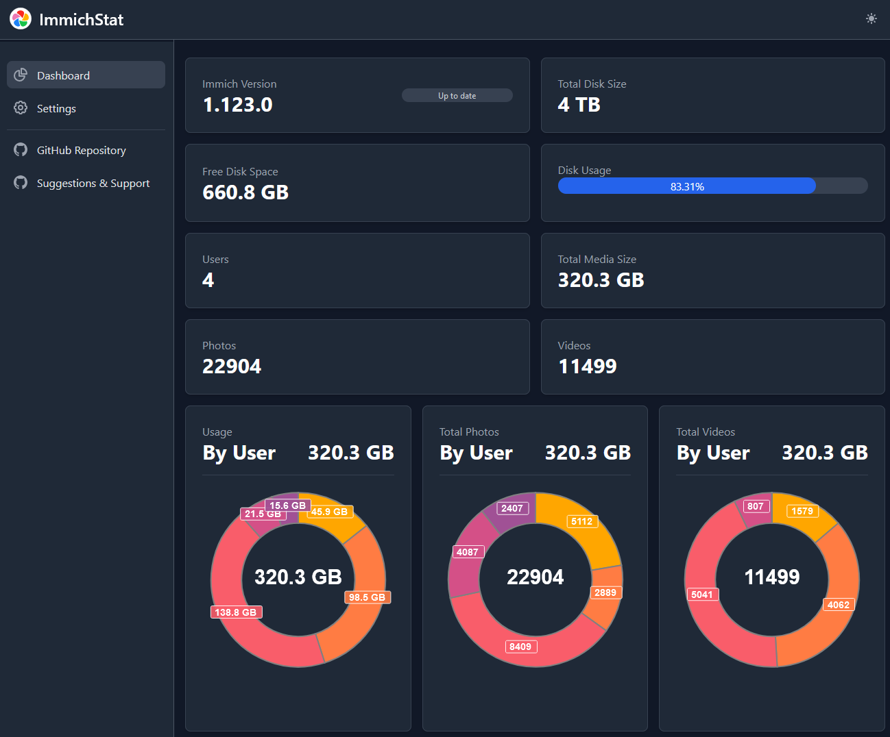

## Track your Immich server stats

### open for suggestions! What do you want to see being tracked?

### Early Release

### Roadmap - things to track

- daily/monthly/yearly growth of media
- detailed overview of each user
- color themes
- detailed uploads (day/month/year) - mean uploads - change over time

## How to run

docker:

`docker run -d -p 8675:3000 -e IMMICH_API_KEY=your_key -e IMMICH_URL=your_url friendlyfriend/immichstat:latest`
