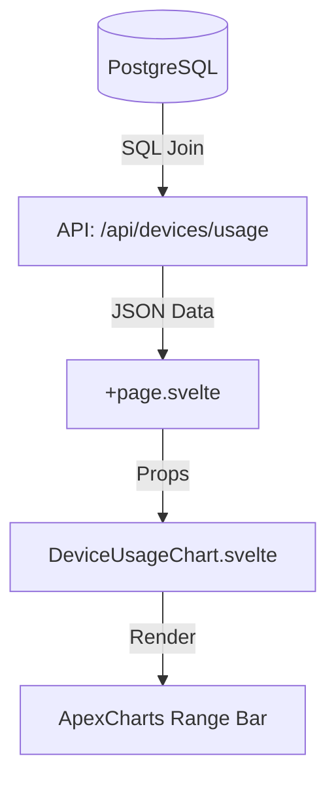

# Plan: Device Usage Over Time Chart

The goal is to implement a timeline chart showing which devices each user has used over time, based on the EXIF data of their uploaded assets.

## Data Source
- **Tables**: `asset` (for `ownerId` and `fileCreatedAt`) and `asset_exif` (for `make` and `model`).
- **Logic**: 
    - Join `asset` and `asset_exif` on `assetId`.
    - Join with `user` to get user names.
    - Group by `userId`, `make`, and `model`.
    - Find `MIN(fileCreatedAt)` and `MAX(fileCreatedAt)` for each group.
    - Exclude null or empty make/model.

## API Endpoint
- Create `src/routes/api/devices/usage/+server.ts`.
- It will return a JSON array of objects:
  ```json
  [
    {
      "userName": "John Doe",
      "deviceName": "Apple iPhone 13",
      "start": "2023-01-01T00:00:00Z",
      "end": "2023-12-31T23:59:59Z"
    },
    ...
  ]
  ```

## Component
- Create `src/lib/components/DeviceUsageChart.svelte`.
- Use `apexcharts` with `type: 'rangeBar'`.
- Y-axis will be a combination of User and Device (e.g., "John Doe - iPhone 13").
- X-axis will be a datetime axis.

## Integration
- Add the `DeviceUsageChart` to `src/routes/+page.svelte`.

## Mermaid Diagram

